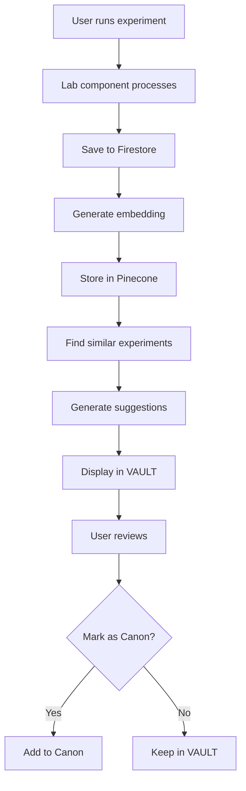
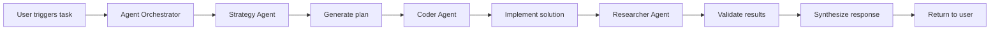

# AGI-CAD Architecture

**System Design Deep-Dive**

This document explains the technical architecture, design decisions, and data flows of AGI-CAD.

---

## Table of Contents

1. [Overview](#overview)
2. [System Architecture](#system-architecture)
3. [Core Systems](#core-systems)
4. [Data Flow](#data-flow)
5. [Component Hierarchy](#component-hierarchy)
6. [State Management](#state-management)
7. [Agent Coordination](#agent-coordination)
8. [Vector Embeddings](#vector-embeddings)
9. [Firestore Schema](#firestore-schema)
10. [API Endpoints](#api-endpoints)
11. [Design Decisions](#design-decisions)
12. [Performance Considerations](#performance-considerations)
13. [Security](#security)
14. [Future Architecture](#future-architecture)

---

## Overview

AGI-CAD is built as a **three-layer system**:

```
┌─────────────────────────────────────────┐
│           PRESENTATION LAYER            │
│  (Next.js + React + Tailwind + Motion)  │
└──────────────┬──────────────────────────┘
               │
┌──────────────▼──────────────────────────┐
│          APPLICATION LAYER              │
│   (Agent System + Lab Registry +        │
│    Canon Tracker + Vector Service)      │
└──────────────┬──────────────────────────┘
               │
┌──────────────▼──────────────────────────┐
│            DATA LAYER                   │
│  (Firestore + Pinecone + LocalStorage)  │
└─────────────────────────────────────────┘
```

---

## System Architecture

### High-Level Architecture

```
┌──────────────────────────────────────────────────────┐
│                    AGI-CAD SOS                       │
├──────────────────────────────────────────────────────┤
│                                                      │
│  ┌────────────┐  ┌────────────┐  ┌────────────┐   │
│  │   VAULT    │  │   FORGE    │  │   CANON    │   │
│  │ (Storage)  │  │ (Creation) │  │ (Knowledge)│   │
│  └─────┬──────┘  └─────┬──────┘  └─────┬──────┘   │
│        │               │               │          │
│        └───────────────┼───────────────┘          │
│                        │                          │
└────────────────────────┼──────────────────────────┘
                         │
       ┌─────────────────┼─────────────────┐
       │                 │                 │
  ┌────▼────┐      ┌────▼────┐      ┌────▼────┐
  │ Agents  │      │  Labs   │      │Embeddings│
  │ System  │      │Registry │      │ Service │
  └────┬────┘      └────┬────┘      └────┬────┘
       │                 │                 │
  ┌────▼────┐      ┌────▼────┐      ┌────▼────┐
  │LangChain│      │Component│      │Pinecone │
  └─────────┘      │  Tree   │      └─────────┘
                   └────┬────┘
                        │
                   ┌────▼────┐
                   │Firestore│
                   └─────────┘
```

---

## Core Systems

### 1. FORGE (Creation Layer)

**Purpose:** Where users create and run experiments

**Components:**
- `src/app/sos/page.tsx` – Main SOS UI
- `src/lib/labs/registry.ts` – Lab registration system
- `src/lib/labs/components/` – Lab implementations

**Data Flow:**
```
User selects lab
    ↓
Lab component loads
    ↓
User adjusts parameters
    ↓
Experiment executes
    ↓
Results → VAULT
```

### 2. VAULT (Persistence Layer)

**Purpose:** Store and retrieve experiments with AI-powered insights

**Components:**
- `src/hooks/useExperiments.ts` – Experiment CRUD operations
- `src/lib/firestore/client.ts` – Firestore client
- `src/components/sos/SmartSuggestions.tsx` – AI suggestions

**Data Flow:**
```
Experiment saved
    ↓
Generate embedding (OpenAI)
    ↓
Store in Pinecone
    ↓
Find similar (Pinecone query)
    ↓
Generate suggestions
    ↓
Display to user
```

### 3. CANON (Knowledge Layer)

**Purpose:** Track and validate build decisions

**Components:**
- `src/lib/canon/canon-tracker.ts` – Canon logic
- `src/components/sos/CanonSidebar.tsx` – Canon UI

**Data Flow:**
```
Decision made
    ↓
Create canon entry (🔄 Exploring)
    ↓
Validated → Pin (📌 Pinned)
    ↓
Confirmed → Lock (🔒 Locked)
    ↓
Export as markdown
```

---

## Data Flow

### Experiment Lifecycle



### Agent Coordination Flow



---

## Component Hierarchy

### SOS Page Structure

```
SOSPage (page.tsx)
├── MissAvakAvatar (overlay)
│   └── Dialog
│       └── Personality Engine
├── AgentStatus (overlay)
├── CanonSidebar (overlay)
├── VAULT (left sidebar)
│   ├── Experiment List
│   └── SmartSuggestions
└── FORGE (center)
    ├── Area Selector
    ├── Lab Grid
    └── Active Lab Component
```

### Component Responsibilities

**Container Components:**
- `SOSPage` – Layout, routing, state management
- `VAULT` – Experiment display and filtering
- `FORGE` – Lab coordination

**Feature Components:**
- `MissAvakAvatar` – AI guide with contextual awareness
- `AgentStatus` – Real-time agent monitoring
- `CanonSidebar` – Decision tracking UI
- `SmartSuggestions` – AI-powered recommendations

**Lab Components:**
- `PlasmaLab` – Physics simulation
- `SpectralLab` – Wavelength analysis
- (Future labs...)

---

## State Management

### Global State (Zustand)

```typescript
// Example store structure
interface GlobalState {
  user: User | null;
  experiments: Experiment[];
  activeAgents: AgentStatus[];
  canonEntries: CanonEntry[];
}
```

**Location:** `src/stores/` (future implementation)

### Local State (React Hooks)

- Component UI state (`useState`)
- Side effects (`useEffect`)
- Performance optimization (`useMemo`, `useCallback`)

### Context State

**Auth Context:**
```typescript
interface AuthContextValue {
  user: User | null;
  loading: boolean;
  signIn: (email, password) => Promise<void>;
  signOut: () => Promise<void>;
}
```

### Persistence

**LocalStorage:**
- Miss Avak conversation history
- Canon sidebar state
- UI preferences

**Firestore:**
- Experiments (persistent)
- User profiles
- Canon entries (future)

**Pinecone:**
- Vector embeddings
- Similarity indices

---

## Agent Coordination

### Architecture

```
┌──────────────────────────────────────┐
│     Agent Orchestrator               │
│  (src/lib/agents/orchestrator.ts)   │
└──────────┬───────────────────────────┘
           │
    ┌──────┴──────┬──────────┐
    │             │          │
┌───▼────┐  ┌────▼───┐  ┌──▼────────┐
│Strategy│  │ Coder  │  │Researcher │
│ Agent  │  │ Agent  │  │  Agent    │
└───┬────┘  └────┬───┘  └──┬────────┘
    │            │         │
    └────────────┴─────────┘
                 │
        ┌────────▼────────┐
        │   LangChain.js  │
        │   (Anthropic/   │
        │    OpenAI)      │
        └─────────────────┘
```

### Agent Configuration

```typescript
// src/lib/agents/agent-config.ts
const strategyAgent = {
  name: 'Strategy Agent',
  systemPrompt: `You are a high-level strategic planner...`,
  model: 'claude-3-5-sonnet-20241022',
  temperature: 0.7,
};
```

### Coordination Pattern

**Sequential Execution:**
1. Strategy Agent plans
2. Coder Agent implements
3. Researcher Agent validates
4. Orchestrator synthesizes

**Parallel Execution (future):**
- Multiple agents work simultaneously
- Results merged by orchestrator

---

## Vector Embeddings

### Embedding Pipeline

```
Experiment Data
    ↓
Text Extraction (title + description + params)
    ↓
OpenAI text-embedding-3-small
    ↓
1536-dimensional vector
    ↓
Store in Pinecone (with metadata)
    ↓
Query for similar vectors (cosine similarity)
    ↓
Return top K matches (K=5 default)
```

### Pinecone Index Structure

**Index Configuration:**
- Name: `agi-cad-experiments`
- Dimension: 1536
- Metric: Cosine
- Pod Type: Serverless (us-east-1)

**Metadata Schema:**
```typescript
interface VectorMetadata {
  experimentId: string;
  title: string;
  labId: string;
  userId: string;
  timestamp: number;
  tags: string[];
}
```

### Similarity Threshold

- **90-100%:** Nearly identical experiments
- **70-89%:** Related experiments (shown in suggestions)
- **50-69%:** Loosely related
- **<50%:** Not similar enough to suggest

---

## Firestore Schema

### Collections

**`users/{uid}`**
```typescript
{
  email: string;
  createdAt: Timestamp;
  displayName?: string;
  photoURL?: string;
  preferences: {
    theme: 'light' | 'dark';
    notifications: boolean;
  }
}
```

**`users/{uid}/experiments/{expId}`**
```typescript
{
  id: string;
  title: string;
  description: string;
  labId: string;
  parameters: Record<string, any>;
  results: Record<string, any>;
  status: 'draft' | 'running' | 'completed' | 'failed';
  tags: string[];
  createdAt: Timestamp;
  updatedAt: Timestamp;
}
```

**`users/{uid}/canon/{canonId}` (future)**
```typescript
{
  id: string;
  type: 'decision' | 'principle' | 'constraint' | 'pattern';
  status: 'exploring' | 'pinned' | 'locked' | 'deviated';
  title: string;
  description: string;
  confidence: number;
  timestamp: Timestamp;
}
```

### Security Rules

```javascript
rules_version = '2';
service cloud.firestore {
  match /databases/{database}/documents {
    match /users/{userId} {
      allow read, write: if request.auth != null && request.auth.uid == userId;

      match /experiments/{experimentId} {
        allow read, write: if request.auth != null && request.auth.uid == userId;
      }
    }
  }
}
```

---

## API Endpoints

### Agent Coordination

**`POST /api/agents/coordinate`**
```typescript
// Request
{
  prompt: string;
  verbose?: boolean;
}

// Response
{
  success: boolean;
  plan: string;
  results: AgentResult[];
  synthesis: string;
  totalTime: number;
}
```

### VAULT Processing

**`POST /api/vault/process`**
```typescript
// Request
{
  experiment: Experiment;
}

// Response
{
  success: boolean;
  experimentId: string;
  embeddingGenerated: boolean;
  embeddingStored: boolean;
  similarExperiments: SimilarExperiment[];
  suggestions: string[];
  processingTime: number;
}
```

---

## Design Decisions

### Why LangChain.js over CrewAI?

**Chosen:** LangChain.js

**Reasons:**
- ✅ Better TypeScript integration
- ✅ Next.js compatibility
- ✅ Active development
- ✅ Smaller bundle size
- ❌ CrewAI is Python-first

### Why Pinecone over Alternatives?

**Alternatives considered:** Weaviate, Milvus, Qdrant

**Reasons for Pinecone:**
- ✅ Serverless (no infrastructure management)
- ✅ Free tier (1M vectors)
- ✅ Fast queries (<100ms p99)
- ✅ Great DX
- ❌ Cost at scale (but manageable)

### Why Next.js App Router?

**Alternatives:** Pages Router, Remix, Vite

**Reasons:**
- ✅ Server Components for performance
- ✅ API routes integrated
- ✅ File-based routing
- ✅ Built-in optimization
- ✅ Vercel deployment ready

### Why Framer Motion?

**Alternatives:** React Spring, GSAP, CSS animations

**Reasons:**
- ✅ Declarative API
- ✅ TypeScript support
- ✅ Layout animations
- ✅ Gesture handling
- ✅ Small bundle impact

---

## Performance Considerations

### Current Optimizations

**Code Splitting:**
- Dynamic imports for heavy components
- Lab components loaded on-demand
- Agent system lazy-loaded

**Caching:**
- SWR for Firestore queries (future)
- Pinecone query caching (future)
- LocalStorage for UI state

**Rendering:**
- React.memo for expensive components
- useMemo for computations
- useCallback for event handlers
- Virtual scrolling (future)

### Performance Targets

- **Time to Interactive:** <2s
- **First Contentful Paint:** <1s
- **Lab Load Time:** <500ms
- **Agent Response:** <5s
- **Embedding Generation:** <2s

---

## Security

### Authentication

- Firebase Authentication
- Email/password (current)
- Google OAuth (future)
- GitHub OAuth (future)

### Authorization

- Firestore Security Rules
- User-scoped data
- No public reads/writes
- API key validation

### Data Protection

- HTTPS only
- API keys in environment variables
- No sensitive data in client
- Encrypted at rest (Firestore)

### Future Enhancements

- Rate limiting
- CAPTCHA for signup
- 2FA support
- Audit logging
- Data export (GDPR)

---

## Future Architecture

### Phase 19-20: User Labs

```
Current: System labs only
Future: User-generated labs

┌─────────────────┐
│  Lab Builder UI │
└────────┬────────┘
         │
    ┌────▼─────┐
    │  Visual  │
    │  Editor  │
    └────┬─────┘
         │
    ┌────▼─────┐
    │Sandboxed │
    │Execution │
    └────┬─────┘
         │
    ┌────▼─────┐
    │ Registry │
    └──────────┘
```

### Phase 21-23: Graph Neural Networks

```
Current: Vector embeddings only
Future: Knowledge graph

┌──────────┐      ┌──────────┐
│Experiments├──────┤ Neo4j KG │
└──────────┘      └────┬─────┘
                       │
                  ┌────▼────┐
                  │ GNN     │
                  │ Model   │
                  └────┬────┘
                       │
                  ┌────▼────┐
                  │Advanced │
                  │Reasoning│
                  └─────────┘
```

### Phase 24+: Full AGI Scaffolding

**Planned Features:**
- Self-improving agents
- Reinforcement learning
- Multi-modal inputs (images, video)
- Collaborative experiments
- Real-time sync
- Agent marketplace

---

## Conclusion

AGI-CAD is architected for:
- **Extensibility** – Easy to add labs, agents, features
- **Scalability** – Serverless, edge-ready
- **Performance** – Optimized bundles, lazy loading
- **Maintainability** – Clear separation of concerns
- **Future-proof** – Designed for AGI evolution

**Questions?** See User Guide or open an issue.

---

**Architecture evolves with canon.** 📜✨
